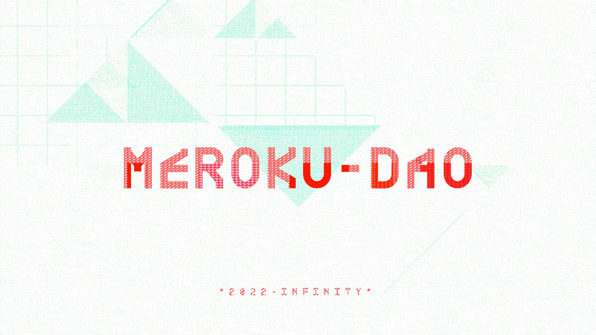

Meroku is the world's first self hosting platform for web3.

## Benefits:

- It allows you (the user) to install and run dApps locally. Complete trust and security.
- It allows you (the developer of dApp) to distribute it to a huge audience without hosting
anywhere.

# Prerequisites

Docker Desktop is required. [Install Docker Desktop](https://www.docker.com/products/docker-desktop/)

# Usage

## Add an app

`node -r ts-node/register src/app.ts add <repoUrl> <name>`

Adds a public git repo hosted at `repoUrl` with the name `name` to local hosting.

## Start an app

`node -r ts-node/register src/app.ts start <name>`

## Stop an app

`node -r ts-node/register src/app.ts start <name>`

## Repos with which this can be tried

- https://github.com/r4881t/v4-ui
- https://github.com/r4881t/cryptoboys-nft-marketplace

# Developer

1. [`Selfhosting` file Spec](docs/Selfhosting.md)
2. [Environment Variables](docs/EnvironmentVariables.md)

# Contributing

Coming Soon. Check out the [roadmap](docs/Roadmap.md).